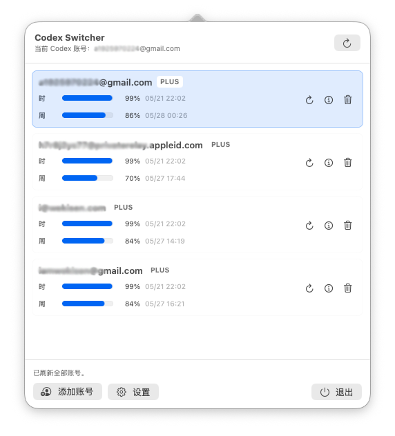

# Codex Switcher

Codex Switcher 是一个 macOS 菜单栏应用，用于在同一台 Mac 上管理多个 Codex / ChatGPT 账号。它可以通过 OpenAI OAuth 登录添加账号，展示小时和周额度的剩余用量，刷新用量，并通过更新标准 Codex CLI 授权文件来切换当前账号。



## 功能

- macOS 菜单栏应用
- 通过 OpenAI OAuth PKCE 流程添加账号
- 点击账号即可切换当前 Codex 账号
- 展示小时额度和周额度的剩余用量
- 支持刷新单个账号或全部账号
- 可选择在唤起面板时自动刷新
- 支持按小时和周剩余额度阈值自动切换账号
- 账号授权文件保存在本机 Application Support 目录
- 切换账号前自动备份当前 Codex 授权文件

## 系统要求

- macOS 13 或更高版本
- Swift 6 工具链
- Xcode 或 Apple Command Line Tools
- 可以访问 OpenAI 登录和 ChatGPT 用量接口

当前 Swift Package 的最低系统版本是 macOS 13：

```swift
.macOS(.v13)
```

## 构建和运行

从源码运行：

```bash
swift run --disable-sandbox CodexSwitcher
```

只执行构建：

```bash
swift build --disable-sandbox
```

## 打包本地 App

生成本地 `.app`：

```bash
./scripts/build-app.sh
```

生成位置：

```text
dist/Codex Switcher.app
```

打包脚本会从源码生成应用图标：

```bash
swift scripts/generate-icon.swift
```

脚本会对本地 App 做 ad-hoc 签名，便于 macOS 识别应用身份。使用开机自启动时，建议将 App 放在固定位置运行，例如：

```text
/Applications/Codex Switcher.app
```

如果每次从不同路径运行，或删除后重新生成再开启自启动，macOS 可能会在登录项中留下旧记录。正式分发时建议使用稳定的 Developer ID 签名和公证流程。

构建产物、打包后的 app、生成的图标文件都已被 Git 忽略，不应该提交到仓库。

## 数据存储

账号保存在本机：

```text
~/Library/Application Support/Codex Switcher/accounts/
```

切换账号时的备份保存在：

```text
~/Library/Application Support/Codex Switcher/backups/
```

当前生效的 Codex 账号仍然使用标准 Codex CLI 授权文件：

```text
~/.codex/auth.json
```

## OAuth 登录

应用内置 OAuth PKCE 登录流程：

- 生成 PKCE verifier 和 challenge
- 启动一个临时本地回调监听服务
- 打开 OpenAI 授权页面
- 通过 `http://localhost:1455/auth/callback` 接收授权回调
- 用授权码换取 token
- 将账号保存到本地账号库

`1455` 端口的服务由 Codex Switcher 自己启动，具体实现在 `OAuthLoginService` 中。它只在添加账号流程中临时监听本机 `localhost` 回调，收到回调或取消后会关闭。

这个流程不依赖 VS Code，也不需要安装或运行 VS Code 插件。

## 安全说明

这个应用会在本机保存 OAuth token，以便切换 Codex 账号。请将你的 macOS 用户账号和 Application Support 目录视为敏感环境。后续正式版本建议将 token 存储迁移到 macOS Keychain。

## 许可证

暂未选择许可证。
